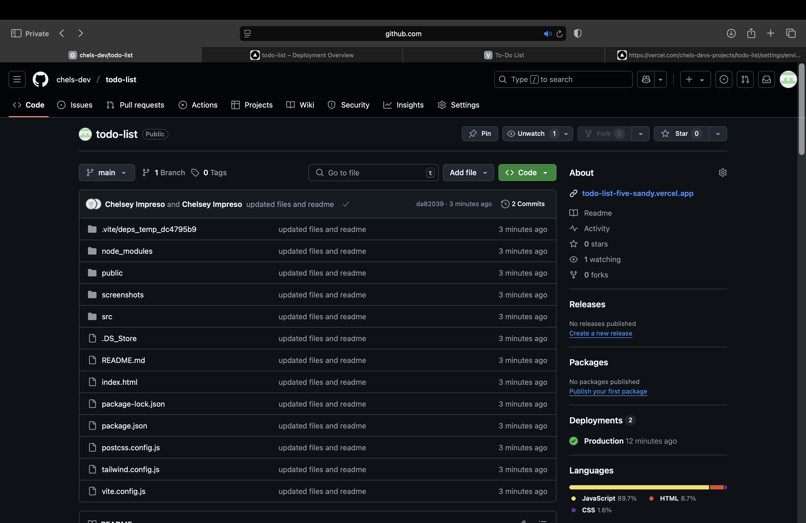

# Chelsey's To-Do List

## 🛠 Deployment Overview

**Hosting Platform**: Vercel  
**Domain**: [todo-list-five-sandy.vercel.app](https://todo-list-five-sandy.vercel.app)  
**SSL**: Enabled (HTTPS)  

### 🚀 Steps Taken
1. Pushed local code to GitHub: `github.com/chels-dev/todo-list`
2. Connected repo to Vercel
3. Deployed app using default settings
4. Configured environment variables in Vercel Dashboard

### 📸 Screenshots
- 
- 
- 
- 
- 

## 🌐 Live App

[View Live](https://todo-list-five-sandy.vercel.app)
